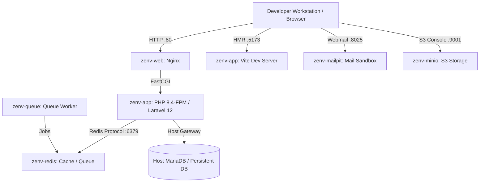

# ⚡️ zenv — Enterprise Zero-Config Docker Environment

[](https://php.net)
[](https://laravel.com)
[](https://filamentphp.com)
[](https://livewire.laravel.com)
[](https://vitejs.dev)
[](https://www.docker.com)
[](LICENSE)

**zenv** (Zero-Config Environment) ist ein hochperformantes, professionelles Docker-Entwicklungsfundament für moderne **Laravel 12** Enterprise-Anwendungen. Es eliminiert langsame Mounts, Dateirechte-Konflikte (UID/GID) und komplexe Setup-Skripte.

---

## 🏛️ Architektur & Systemübersicht



---

## 🛠️ Integrierte Enterprise Services

| Service | Container | Internal Port | Host Port | Beschreibung / URL |
| :--- | :--- | :--- | :--- | :--- |
| **Nginx Webserver** | `zenv-web` | `80` | `80` | **[http://localhost](http://localhost)** |
| **Vite Dev Server** | `zenv-app` | `5173` | `5173` | **[http://localhost:5173](http://localhost:5173)** (Hot Reload) |
| **Mailpit Sandbox** | `zenv-mailpit` | `1025` / `8025` | `8025` | **[http://localhost:8025](http://localhost:8025)** (E-Mail UI) |
| **MinIO S3 Storage** | `zenv-minio` | `9000` / `9001` | `9001` | **[http://localhost:9001](http://localhost:9001)** (AWS S3 Emulator) |
| **Redis Cache** | `zenv-redis` | `6379` | `6379` | High-Speed Cache & Session Store |
| **Queue Worker** | `zenv-queue` | - | - | Auto-executing `artisan queue:work` |
| **Host MariaDB** | *Host System* | `3306` | `3306` | Persistent DB via `host.docker.internal` |

---

## ⚡️ Quickstart (In 3 Minuten einsatzbereit)

### 1. Repository klonen
```bash
git clone https://github.com/DEIN_USERNAME/zenv-laravel.git mein-projekt
cd mein-projekt
```

### 2. Skript-Berechtigungen prüfen
```bash
chmod +x zenv
```

### 3. Umgebung starten & Laravel initialisieren
```bash
# Container starten
./zenv up

# Abhängigkeiten installieren & Datenbank migrieren
./zenv composer install
./zenv artisan migrate
```

---

## 💻 `./zenv` CLI Cheatsheet

Verwende das elegante `./zenv` Skript anstelle langer Docker-Befehle:

### Container-Management
```bash
./zenv up          # Dienste im Hintergrund starten
./zenv down        # Dienste stoppen und Container entfernen
./zenv restart     # Dienste neu starten
./zenv ps          # Status aller Container anzeigen
./zenv logs        # Live-Logs aller Container anzeigen
```

### Entwicklungs-Befehle
```bash
./zenv artisan migrate       # Laravel Migrationen ausführen
./zenv artisan make:model    # Model & Migration erstellen
./zenv composer require ...  # PHP Paket installieren
./zenv npm run dev           # Vite Hot-Reloading starten
./zenv npm run build         # Assets für Production bauen
./zenv pest                  # Pest PHP Testsuite ausführen
./zenv shell                 # Bash-Shell im PHP Container öffnen
```

---

## 🔐 Datenbank-Persistenz (Zero Data Loss)

**zenv** verbindet sich über den Host-Gateway `host.docker.internal` direkt mit deiner lokalen MariaDB auf dem Entwickler-Rechner.

* **Vorteil:** Das Herunterfahren oder Löschen der Docker-Container führt **niemals zu Datenverlust**.
* **DB-Host (in `.env`):** `host.docker.internal`
* **DB-Port:** `3306`

---

## 📄 Lizenz & Contributing

Dieses Projekt ist unter der **MIT Lizenz** veröffentlicht. Pull Requests und Feedback sind herzlich willkommen!
